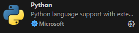

# Programmierübung MRT
Leitlinien für den Einstieg in die Bearbeitung der Programmierübungen zur Vorlesung *MRT: Bilderzeugung, Bildrekonstruktion, Bildverarbeitung*.

Es gibt eine Vielzahl an Wegen Python zu nutzen welche häufig ihre ganz eigenen Vorteile bringen. Diese Anleitung ist als Hilfe gedacht um einen Einstieg so einfach wie möglich zu machen mti der sehr verbreiteten Programmierumgebung Visual Studio Code. 

## Setup von Visual Studio Code:
Folgen Sie diesen Schritten um die Programmierumgebung Visual Studio Code einzurichten:
* Die neueste VS Code Version für das jeweilige Betriebssystem herunterladen unter https://code.visualstudio.com/download und installieren. Empfohlen wird der "User installer" mit Standardeinstellungen.
* Falls nicht auf ihrem System vorhanden Python herunterladen unter https://python.org/downloads und installieren. Empfohlen wird Version 3.12. Unter Windows ist während der Installation darauf zu achten, dass "Python zu PATH hinzufügen"/"Add Python to PATH" aktiviert ist.
* In VS Code das Extensions-Menü (vier Quadrate) am linken Rand öffnen und "Python" (von Microsoft) installieren.\

*Optional aber empfohlen*:
* In VS Code das Extensions-Menü am linken Rand öffnen und "Pylint" (von Microsoft) installieren. Pylint markiert Syntaxfehler im Code automatisch und gibt Tipps für eine übersichtliche Formatierung.
* In VS Code das Extensions-Menü am linken Rand öffnen und "Jupyter" (von Microsoft) installieren.

## Ein neues Projekt mit eigener Python-Umgebung erstellen
Folgen Sie diesen Schritten um eine unabhängige Python Umgebung zu erstellen. Diese stellt die Basis für einen unkomplizierten Umgang mit nützlichen Python Paketen dar. In diesem Beispiel wird *venv* verwendet welches in Python integriert ist.  Alternativ können auch Manager mit weiteren Funktionen verwendet werden wie zum Beispiel auch Anaconda.
* In VS Code unter "Datei"->"Ordner öffnen" einen vorher angelegten Projektordner öffnen.
* Mit "Terminal"->"Neues Terminal" ein Terminal öffnen und in diesem folgenden Command ausführen:\
*python -m venv .venv*\
Falls ältere Python Versionen auf dem Gerät vorhanden sind (oft bei MacOS) sollte explizit python3 verwendet werden:\
*python3 -m venv .venv*
* Sobald dies abgeschlossen ist kann das VS Code Fenster geschlossen und neu geöffnet werden. VS Code erkennt beim erneuten Öffnen die virtuelle Umgebung und fragt ob diese verwendet werden soll. Wenn dies akzeptiert wird startet VS Code neue Terminals automatisch in dieser Umgebung. Sichtbar ist eine aktivierte Umgebung durch *(.venv)* zu Beginn der aktuellen Zeile im Terminal.
* In einem Terminal mit aktivierter Python-Umgebung können nun Pakete installiert werden via pip. Eines der bekanntesten ist numpy.
*pip install numpy*

